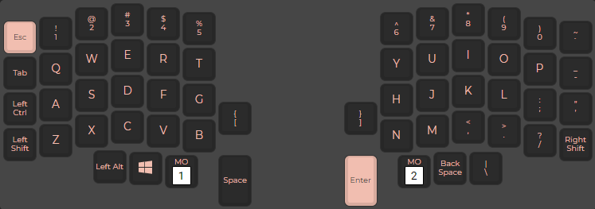
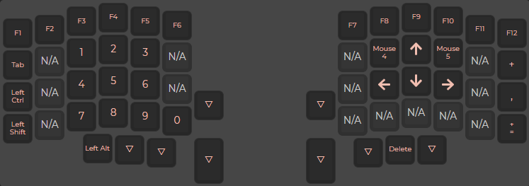
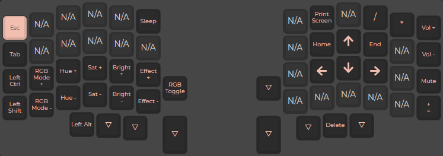

# Lily58 pro

Custom QMK firmware build for Lily58 pro keyboard. Keymap is built with [QMK Configurator](https://config.qmk.fm/#/lily58/rev1/LAYOUT).

Image converting tool [image2cpp](https://javl.github.io/image2cpp/).

## QMK CLI Commands
---
If, for whatever reason, you want to flash your Lily58 PRO with this firmware, download this repository and open the `.hex` file with the QMK Toolbox, and flash it onto both microcontrollers (This firmware was developed and tested only with Elite-c V4).

To rebuild this firmware you have to convert keymap from the QMK website to `.c` file first. You can convert `.JSON` Keymap folder into `.c` with json2c:

` qmk json2c <json path here> -o keymap.c`
(make sure you are in the `keymaps/<enter-name>` folder.)

Compile new firmware from the root of the `qmk_firmware`:

`make lily58:<keymap folder path here>` or `qmk compile -kb <keyboard> -km <keymap>`

New `.hex` file will be generated in the root of the `qmk_firmware` folder. Move the file in desired folder, and flash it onto microcontroller via QMK Toolbox

## OLED Images
---
**Left side OLED:**

**Right side OLED:**

## Keymap
---
**Layer 0:**

**Layer 1:**

**Layer 2:**

